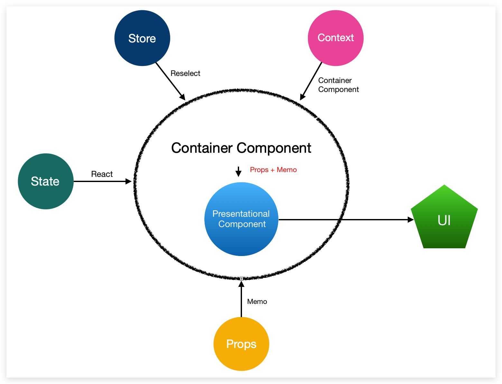

## Prologue
### Pure and Impure function
- Pure function
```javascript
const add = (a, b) => {
  return a + b;
}
```
- Impure function 1
```javascript
const b 
const add = (a) => {
  return a + b;
}
```
- Impure function 2
```javascript
const add =(a,b) => {
  Api.post('/add', {a,b}, (response) => {
    // do something which cause external changes.
  })
}
```
### Copy things immutably
- copy object immutably
```javascript
const original = {a: 1, b: 2};
const copy2 = {...original}
```
- copy array immutably
```javascript
const original = [1, 2, 3];
const copy2 = [...original];
```

### Important Functions
- `compose`
```javascript
import { compose } from 'redux';

const makeLouder = string => string.toUpperCase();
// @ts-ignore
const repeatThreeTimes = string => string.repeat(3);
const embolden = string => string.bold();

const makeLouderAndRepeatThreeTimesAndEmbolden = compose(makeLouder, repeatThreeTimes, embolden);

const tag = document.createElement("span");
const textNode = document.createTextNode(makeLouderAndRepeatThreeTimesAndEmbolden('b'));
tag.append(textNode);
document.getElementById("app")!.appendChild(tag);
```
- `store.subscribe`
```javascript
const store = createStore(rootReducer);
const unsubscribe = store.subscribe(() => {
  console.log(store.getState().a);
});
store.dispatch({ type: "ADD_ONE", payload: 1 });
store.dispatch({ type: "ADD_ONE", payload: 1 });
store.dispatch({ type: "ADD_ONE", payload: 1 });
store.dispatch({ type: "ADD_ONE", payload: 1 });
store.dispatch({ type: "ADD_ONE", payload: 1 });
unsubscribe();
```

## Normalized state
- `normalizr`: `id` is a **must**; only define **relationships** to do normalization.
- no nesting structure
- no duplicate data
- use `{}` as the state of world, use `unique id` to look up objects

### Lodash/fp
- [Docs](https://gist.github.com/jfmengels/6b973b69c491375117dc#_setpath-value-object)

## Optimization
### useSelector
- [Docs](https://react-redux.js.org/next/api/hooks#useselector)
- The component will re-render only if the the **computed result of selector** has changed. The change of state `doesn't necessaril`y cause specific component to re-render.
- Default Equality Compare: `===`
- `Change` default equality compare:
```javascript
 // other methods: lodash.isEqual(), immutable.js的equal
 const lists = useSelector(listsSelector, shallowEqual);
```
- The changes of  **multiple** `useSelectors` in one component will only cause the component to render **once**.
- 
### Reselect
- [Docs](https://react-redux.js.org/next/api/hooks#using-memoizing-selectors)
- Reselect `won't stop` re-render. It just store and **re-use** the last render.
- **props is passed always in second function**
#### Why we use reselect?
- Memorize `complex computation` results
- **De-normalize** the store state
#### How to use memoized selectors?
- Return type: **primitive** types
  - useSelector use `===` to compare
- Return type: **reference** types
  - Please set the compare method as shallow compare at first
#### Where should I declare memoized selectors?
- You should always avoid `render level`

|    Level    |  Dependency   |     Location      | Memoized |
| :---------: | :-----------: | :---------------: | :------: |
| `Component` |     State     | Outside Component |  False   |
| `Instance`  | State & Props | Inside Component  | **True** |
|  `Render`   |     State     | Inside Component  |  False   |
- Instance Example
```javascript
const makeNumOfTodosWithIsDoneSelector = () =>
  createSelector(
    state => state.todos,
    (_, isDone) => isDone,
    (todos, isDone) => todos.filter(todo => todo.isDone === isDone).length)

export const TodoCounterForIsDoneValue = ({ isDone }) => {
  const selectNumOfTodosWithIsDone = useMemo(makeNumOfTodosWithIsDoneSelector,[])
  const numOfTodosWithIsDoneValue = useSelector(state =>selectNumOfTodosWithIsDone(state, isDone))
  return <div>{numOfTodosWithIsDoneValue}</div>
}
``` 

<div style="text-align:center; margin:auto"></div>

### memo
- You should use `memo` on **any component** having a `parent component`
- memo is used only for compare `props`, If `state` of `store` changes, the component will still **re-render**, 
- Default Compare Method: **Shallow Comparison**
- `Modify` Default Compare Method:
```javascript
import { memo } from 'react';
const myComponent = (props) => {...}
const areEqual = (prevProps, nextProps) => {...}
export default memo(MyComponent, areEqual);
```
## Architecture
### Short-term Plan
- `Reduce same API Calls within a very short time`:
  - **debounce**： eliminate `duplicate` API calls within `a very short time`.
- `Reduce unnecessary computation and re-render`:
  - **batch**: `batch `update the redux store.
  - **useSelector**： modify `===` to `shallow comparison`
  - **reselect**: cache `app level`, `component level` and `instance level` **de-normalization** or **complex computation** process. (will still cause page to render)
  - **memo**: cache `props -> dom` (will remove duplicate render based same props)
  - **useMemo**: cache computation process based on `component's own state`.

#### Progress

|   Feature   | Project | Task  | Property | Template | Portfolio | Documents | Companies | Users |
| :---------: | :-----: | :---: | :------: | :------: | :-------: | :-------: | :-------: | :---: |
|    memo     |   ✔️    |  ✔️   |    ❎     |    ❎     |     ❎     |     ❎     |     ❎     |   ❎   |
|   memoAC    |   ✔️    |  ✔️   |    ✔️    |    ✔️    |    ✔️     |    ✔️     |    ✔️     |  ✔️   |
| useSelector |   ✔️    |  ✔️   |    ❎     |    ❎     |     ❎     |     ❎     |     ❎     |   ❎   |
|  reselect   |   ✔️    |  ✔️   |    ❎     |    ❎     |     ❎     |     ❎     |     ❎     |   ❎   |
|    batch    |   ✔️    |  ✔️   |    ❎     |    ❎     |     ❎     |     ❎     |     ❎     |   ❎   |

### React-Redux 架构
- 扁平化`Store`: `normalizr`
```javascript
   projects: {
     entities: { id1: value1, id2: value2}, // hashMap, O(1)查询
     ids: {id1, id2} // 初始化排序
   }
   tasks: { ... } // 格式同上
```
- `不可变方式`更新数据: `ES6`, `lodash/fp`, `immer`, `immutable.js`
#### 场景一： 多用户共享状态管理
- 核心思想：
  - 多用户更新通过**订阅**后端API和前端**监听**执行来实现
- 实现关键:
  - 后端API的`pub/sub`功能, 依赖于`websocket`
  - 前端订阅，将数据加入到一个`Queue`中，设置`Event Loop`将变化`映射`到**Store**
- 后端数据特征:
  - 只跟**当前用户**有关的数据
  - 只是由**其他用户**引起的数据变化
  - 格式: `更新者Id`, `更新时间`, `资源类型`，`资源Id`, `改动类型(增、删、改)`
  - 批量优化: 在`一定时间`内，对同一资源，只实现`一次`**最近**更新
- 其他:
  - 获取`类型`和`Id`来寻找对应的`Action Creator`来`更新数据`(Getter)
  - 调用Redux原生`batch()`来实现**批量映射**
- 思考:
  - 批量优化中的`一定时间`设为多少为好?
  - 格式中的`增删改`是否应该和`Redux`中的`Type`保持一致?

#### 场景二：单用户状态管理
- 核心思想:
  - 只进行**一次**状态的**初始化**映射(API => Store)
  - 通过`增、删、改`来**更新**状态
- 实现关键:
  - 前端维护一个`HashMap`, **key**为初始化`Type`, **value**为`次数`
  - 所有状态的**初始化操作**，都要经过一个`filter`审核，**避免多次初始化统一页面**, 可封装为`Hooks`
- 其他:
  - 只有**初始化**`Getter`操作才经过filter, **更新**无须经过filter
  - 只有**当前用户**的触发的Getter才经过filter, **多用户订阅**的Getter无须经过filter
- 思考:
  - 同一`Tab`的`Link`和`Redirect`会引起store**重载**吗?
  - **不同Chrome Tab**间如何`共享状态`？
  - **不同浏览器**之间如何`共享状态`？

#### 场景三: 局部状态管理
- 核心思想:
  - 通过**状态提升**到`父`组件，给`多个子组件`实现状态共享
- 实现关键:
  - 涉及到**store**的时候，父组件将获取entities数据，维护**排序**后的ids，并且只传递给子组件资源**id**，而非资源本身
  - 涉及到局部**state**的时候, 传递父组件中的`state update`方法到子组件中, 由`子`组件触发state更新操作
- 其他：
  - `排序逻辑`可以抽离为**层**，实现共享
#### 场景四：状态 -> UI
<div style="text-align:center; margin:auto"></div>

- 使用**Container Component**来接受组件所有外部状态: `props`, `store`, `context`
- **Presentational Component**只维护组件自己的`state`状态
- 优化:
  - `props`: 使用`memo`来进行记忆,
  - `store`: 使用`reselect`来进行记忆优化
  - `Context`: 在**container component**中控制`是否传入context信息`作为**props**来节约渲染
  - `state`: 分场景使用`单值state`, `复合state`, 涉及到和props交互时用`useReducer`
- props的记忆问题：
  - `primitive type`: **default**
  - `只有一层的Object`: **shallow compare**
  - `很多层的Object`: **deep compare**
- 思考
  - `Container Pattern`, `HOC pattern`和`Render Props Pattern`的应用场景?
  - **对比方式**比较: `memo`, `selector`, `reselect`
- 记忆方法对比

| Memoized Func |      Location       |   Default Compare    | Configurable |
| :-----------: | :-----------------: | :------------------: | :----------: |
|  `useEffect`  |      **deps**       |        `===`         |    False     |
| `useCallback` |      **deps**       |        `===`         |    False     |
|   `useMemo`   |      **deps**       |        `===`         |    False     |
|    `memo`     |   **props input**   | `shallow comparison` |     True     |
| `useSelector` | **selector output** |        `===`         |   **True**   |
|  `reselect`   | **selector input**  |        `===`         |     True     |

#### 未来
- NPM: `globalize`适配当地时间
- `虚拟列表`优化
- `PWA` + `Service Workers`
- `Server Side Rendering`
- `GraphQL`的应用

## Reference
- [Github/reselect](https://github.com/reduxjs/reselect#reselect)
- [Redux Hooks](https://react-redux.js.org/next/api/hooks#hooks)
- [React组件设计实践总结](https://bobi.ink/2019/05/10/react-component-design-01/)
- [React Patterns](https://reactpatterns.cn/)
- [React Bits](https://vasanthk.gitbooks.io/react-bits/)
- [Mind Hacks](http://mindhacks.cn/)
- [有赞技术](https://tech.youzan.com/tag/team-introduction/)