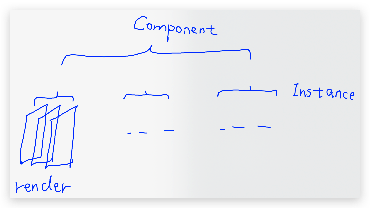

## Prologue
### Pure and Impure function
- Pure function
```javascript
const add = (a, b) => {
  return a + b;
}
```
- Impure function 1
```javascript
const b 
const add = (a) => {
  return a + b;
}
```
- Impure function 2
```javascript
const add =(a,b) => {
  Api.post('/add', {a,b}, (response) => {
    // do something which cause external changes.
  })
}
```
### Copy things immutably
- copy object immutably
```javascript
const original = {a: 1, b: 2};
const copy2 = {...original}
```
- copy array immutably
```javascript
const original = [1, 2, 3];
const copy2 = [...original];
```

### Important Functions
- `compose`
```javascript
import { compose } from 'redux';

const makeLouder = string => string.toUpperCase();
// @ts-ignore
const repeatThreeTimes = string => string.repeat(3);
const embolden = string => string.bold();

const makeLouderAndRepeatThreeTimesAndEmbolden = compose(makeLouder, repeatThreeTimes, embolden);

const tag = document.createElement("span");
const textNode = document.createTextNode(makeLouderAndRepeatThreeTimesAndEmbolden('b'));
tag.append(textNode);
document.getElementById("app")!.appendChild(tag);
```
- `store.subscribe`
```javascript
const store = createStore(rootReducer);
const unsubscribe = store.subscribe(() => {
  console.log(store.getState().a);
});
store.dispatch({ type: "ADD_ONE", payload: 1 });
store.dispatch({ type: "ADD_ONE", payload: 1 });
store.dispatch({ type: "ADD_ONE", payload: 1 });
store.dispatch({ type: "ADD_ONE", payload: 1 });
store.dispatch({ type: "ADD_ONE", payload: 1 });
unsubscribe();
```

## Normalized state
- no nesting structure
- no duplicate data
- use `{}` as the state of world, use `unique id` to look up objects

### Lodash/fp
- [Docs](https://gist.github.com/jfmengels/6b973b69c491375117dc#_setpath-value-object)

## Optimization
### useSelector
- [Docs](https://react-redux.js.org/next/api/hooks#useselector)
- The component will re-render only if the the **computed result of selector** has changed. The change of state `doesn't necessaril`y cause specific component to re-render.
- Default Equality Compare: `===`
- `Change` default equality compare:
```javascript
 // other methods: lodash.isEqual(), immutable.js的equal
 const lists = useSelector(listsSelector, shallowEqual);
```
- The changes of  **multiple** `useSelectors` in one component will only cause the component to render **once**.
- 
### Reselect
- [Docs](https://react-redux.js.org/next/api/hooks#using-memoizing-selectors)
- Reselect `won't stop` re-render. It just store and **re-use** the last render.
#### Why we use reselect?
- Memorize `complex computation` results
- **De-normalize** the store state
#### How to use memoized selectors?
- Return type: **primitive** types
  - useSelector use `===` to compare
- Return type: **reference** types
  - Please set the compare method as shallow compare at first
#### Where should I declare memoized selectors?
- You should always avoid `render level`

|    Level    |  Dependency   |     Location      | Memoized |
| :---------: | :-----------: | :---------------: | :------: |
| `Component` |     State     | Outside Component |  False   |
| `Instance`  | State & Props | Inside Component  | **True** |
|  `Render`   |     State     | Inside Component  |  False   |
- Instance Example
```javascript
const makeNumOfTodosWithIsDoneSelector = () =>
  createSelector(
    state => state.todos,
    (_, isDone) => isDone,
    (todos, isDone) => todos.filter(todo => todo.isDone === isDone).length)

export const TodoCounterForIsDoneValue = ({ isDone }) => {
  const selectNumOfTodosWithIsDone = useMemo(makeNumOfTodosWithIsDoneSelector,[])
  const numOfTodosWithIsDoneValue = useSelector(state =>selectNumOfTodosWithIsDone(state, isDone))
  return <div>{numOfTodosWithIsDoneValue}</div>
}
``` 

<div style="text-align:center; margin:auto"></div>

### memo
- You should use `memo` on **any component** having a `parent component`
- memo is used only for compare `props`, If `state` of `store` changes, the component will still **re-render**, 
- Default Compare Method: **Shallow Comparison**
- `Modify` Default Compare Method:
```javascript
import { memo } from 'react';
const myComponent = (props) => {...}
const areEqual = (prevProps, nextProps) => {...}
export default memo(MyComponent, areEqual);
```
## summary
- 不错的不可变工具库: `immer`
- Memoized Func Sum

| Memoized Func |      Location       |   Default Compare    | Configurable |
| :-----------: | :-----------------: | :------------------: | :----------: |
|  `useEffect`  |      **deps**       |        `===`         |    False     |
| `useCallback` |      **deps**       |        `===`         |    False     |
|   `useMemo`   |      **deps**       |        `===`         |    False     |
|    `memo`     |   **props input**   | `shallow comparison` |     True     |
| `useSelector` | **selector output** |        `===`         |   **True**   |
|  `reselect`   | **selector input**  | `shallow comparison` |     True     |

## Reference
- [React组件设计实践总结](https://bobi.ink/2019/05/10/react-component-design-01/)
- [Mind Hacks](http://mindhacks.cn/)